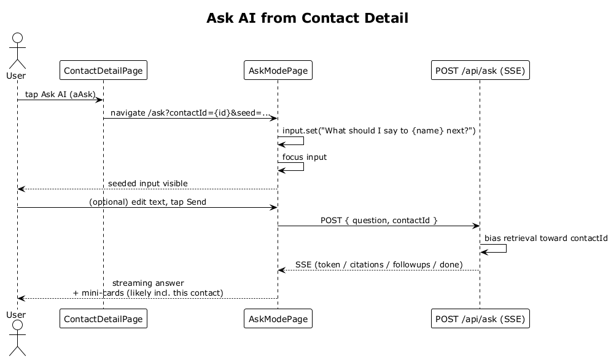

# 23 — Ask AI from Contact Detail

## Summary

The `Ask AI` quick action on the contact detail view opens the Ask screen with the input pre-seeded to a contact-scoped prompt (e.g., `"What should I say to Sarah Mitchell next?"`). The question, when sent, biases retrieval toward that contact by passing `contactId` on the request.

**Traces to:** L1-010, L2-040.

## Actors

- **User** — authenticated owner.
- **ContactDetailPage** — `Ask AI` tile (`aAsk` / gradient-filled).
- **AskModePage** — target screen.
- **AskEndpoints** — `POST /api/ask`.

## Trigger

User taps the `Ask AI` action tile on a contact detail.

## Flow

1. User taps `Ask AI`.
2. The SPA navigates to `/ask?contactId={id}&seed={template}`.
3. `AskModePage` reads the query params, sets the input text to `"What should I say to {displayName} next?"`, and focuses the input.
4. The user may edit or send as-is.
5. On send, the SPA POSTs `/api/ask { question, contactId }`.
6. The endpoint biases retrieval toward that `contactId` (e.g., prioritises that contact's embeddings in the top-K and boosts its score), then runs the normal streaming flow (flows 19–21).
7. The SPA streams the answer, renders citations (likely including the contact), and shows follow-ups.

## Alternatives and errors

- **User edits the seeded text** → the edited text is what submits.
- **User clears the input without typing** → Send is disabled.
- **Contact has no interactions** → the seeded prompt still renders; retrieval degrades gracefully to the user's broader context.

## Sequence diagram

