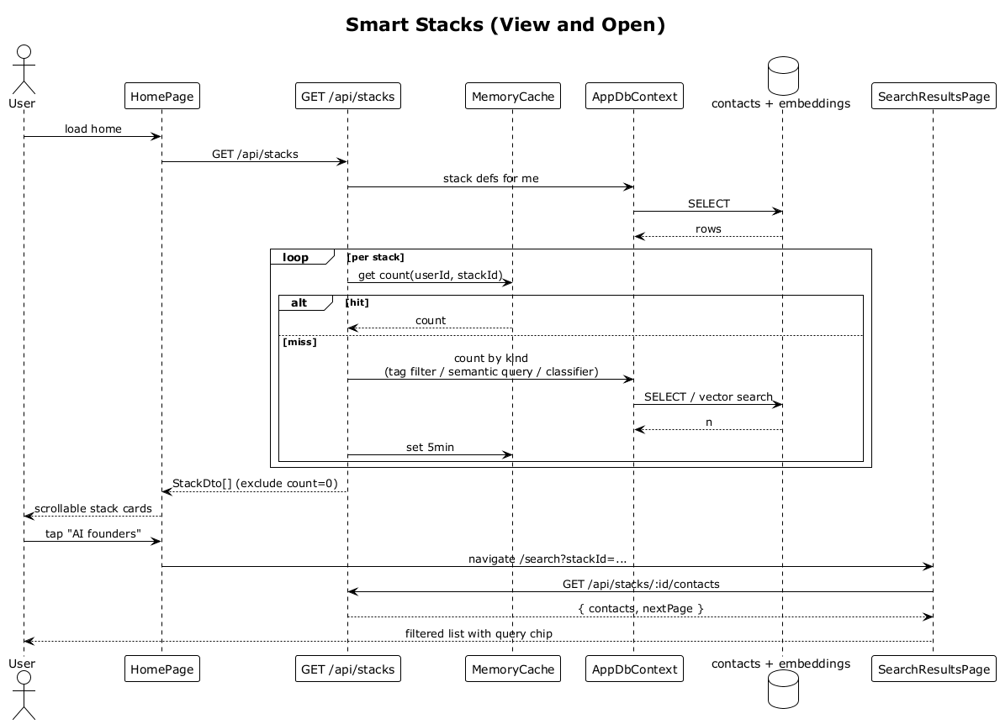

# 24 — Smart Stacks (View and Open)

## Summary

The home screen shows a horizontally scrollable row of curated groupings ("Smart Stacks") with count + label (e.g., `27 AI founders`, `14 Intros owed`, `9 Close friends`). Each stack is a tag filter, saved semantic query, or AI classification. Tapping a stack opens a filtered list (the search results screen with a pre-applied filter).

**Traces to:** L1-006, L2-026, L2-027, L2-028.

## Actors

- **User** — authenticated.
- **HomePage** — `stacksRow`.
- **StacksEndpoints** — `GET /api/stacks`, `GET /api/stacks/{id}/contacts`.
- **MemoryCache** — per-user, per-stack count, 5-minute TTL.
- **AppDbContext** — over `contacts` and embeddings.
- **SearchResultsPage** — the filtered destination.

## Trigger

User opens home; user taps a stack card.

## Flow — render

1. On home mount, the SPA GETs `/api/stacks`.
2. The endpoint loads the user's stack definitions.
3. For each stack the endpoint asks `MemoryCache` for `count(userId, stackId)`:
   - **Hit** → use the cached count.
   - **Miss** → run the stack's count query (tag filter, saved semantic query via pgvector, or AI classifier), store for 5 min.
4. Responds `StackDto[] { id, label, count, kind }`.
5. Stacks with `count = 0` are hidden by the SPA (never shown as `0 …`).
6. The SPA renders scrolling cards, padded to match the mobile design (`x=24`).

## Flow — open

1. User taps `AI founders`.
2. The SPA navigates to `/search?stackId=...`.
3. The SPA calls `GET /api/stacks/:id/contacts?page=1&pageSize=50`.
4. Server returns the contacts for that stack (paginated like search results).
5. `SearchResultsPage` renders with the stack's label as the query chip.

## Alternatives and errors

- **Stack count becomes 0** → next home render hides the card; existing deep-links still work (returns empty list).
- **User B loads home** → sees only their own stacks (owner-scoped).
- **Add/update contact** → count is recomputed on next cache miss (no websocket invalidation in v1).

## Sequence diagram

