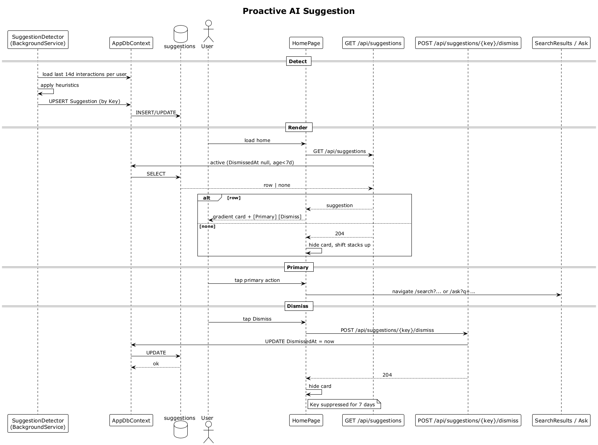

# 25 — Proactive AI Suggestion (Render and Dismiss)

## Summary

A background `SuggestionDetector` scans each user's recent interaction patterns on a schedule and upserts `Suggestion` rows keyed by a deterministic `suggestionKey`. On home render, the API returns the currently active (undismissed, < 7 days old) suggestion as a gradient card. Primary action seeds a search or Ask. `Dismiss` persists `DismissedAt`, suppressing that key for 7 days.

**Traces to:** L1-007, L2-029, L2-030.

## Actors

- **SuggestionDetector** (BackgroundService) — periodic scan.
- **AppDbContext / suggestions table**.
- **User** — authenticated.
- **HomePage** — `AI suggestion` card.
- **SuggestionsEndpoints** — `GET /api/suggestions`, `POST /api/suggestions/{key}/dismiss`.
- **SearchResultsPage / AskModePage** — primary-action destinations.

## Trigger

- Background: scheduled scan (every N hours).
- User: opens home; taps Dismiss; taps primary action.

## Flow — detect

1. The detector loads each user's last 14 days of interactions.
2. It applies heuristics (e.g., ≥ 3 meetings tagged `AI founder` in 7 days → "find similar investors" suggestion).
3. For each match it UPSERTs a `Suggestion` row keyed by `(userId, suggestionKey)`.

## Flow — render

1. On home load the SPA GETs `/api/suggestions`.
2. The endpoint selects the first active suggestion (no `DismissedAt`, age < 7 d) for the user.
3. If found, returns `SuggestionDto { key, heading, body, primaryAction }`.
4. The SPA renders the gradient card with body, primary pill, and Dismiss ghost.
5. If none, the SPA hides the card slot and shifts the `Smart stacks` section up.

## Flow — primary action

1. User taps the primary pill (e.g., `Find similar investors`).
2. The SPA routes to `/search?stackId=...` or `/ask?q=...` depending on `primaryAction.kind`.

## Flow — dismiss

1. User taps `Dismiss`.
2. The SPA POSTs `/api/suggestions/{key}/dismiss`.
3. The endpoint sets `DismissedAt = UtcNow`.
4. Responds `204 No Content`.
5. The SPA hides the card immediately.
6. That key is suppressed for 7 days even if the signal persists.

## Alternatives and errors

- **No qualifying signal** → card is omitted, slot collapses.
- **Two qualifying suggestions** → only the first is rendered; dismissing it allows the other next day.
- **Dismiss dup** → idempotent (setting `DismissedAt` again is a no-op).

## Sequence diagram

