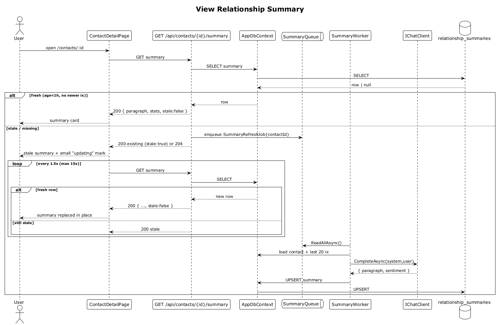

# 26 — View Relationship Summary

## Summary

The contact detail screen renders a `RELATIONSHIP SUMMARY` card with an AI paragraph and a stat band (`Interactions`, `Sentiment`, `Since last`). The server returns the cached summary when it's less than 1 hour old and has no newer interaction; otherwise it enqueues a background `SummaryRefresh` and either returns the stale-marked cache or the freshly regenerated row if the SPA polls until it completes.

**Traces to:** L1-008, L2-031, L2-032, L2-033.

## Actors

- **User** — authenticated owner.
- **ContactDetailPage** — summary card.
- **SummaryEndpoints** — `GET /api/contacts/{id}/summary`.
- **AppDbContext / relationship_summaries**.
- **SummaryQueue** + **SummaryWorker** — background LLM caller.
- **IChatClient** — LLM provider.

## Trigger

User opens contact detail.

## Flow

1. User opens `/contacts/:id`.
2. The SPA GETs `/api/contacts/:id/summary`.
3. The endpoint selects the cached summary.
4. **Fresh (age < 1 h, no newer interaction)** → returns `{ paragraph, stats, stale:false }`.
5. **Stale / missing**:
   - If missing: enqueue `SummaryRefreshJob { contactId }`, respond `204 No Content` (or return an empty stub with `stale:true`).
   - If stale: enqueue refresh, respond with the previous paragraph flagged `stale:true`.
6. The SPA shows the summary (possibly flagged `stale`) and, if the card is empty/stale, polls `/summary` every 1.5 s (max 15 s).
7. Background: `SummaryWorker` pulls the job, loads the contact + last 20 interactions, calls `IChatClient.CompleteAsync(system, user)`, UPSERTs the summary row with `{ paragraph, sentiment, interactionCount, sinceLast }`.
8. The next SPA poll returns the fresh row and the UI updates in place.

## Alternatives and errors

- **Zero interactions** → the summary returns an empty stub with stat band `0 / — / —`.
- **Regen fails** → last valid summary remains; small `stale` indicator is shown; auto-retry on next open.
- **Auto-invalidation** — creating, updating, or deleting an interaction enqueues the refresh (flows 11, 13, 14).

## Sequence diagram

