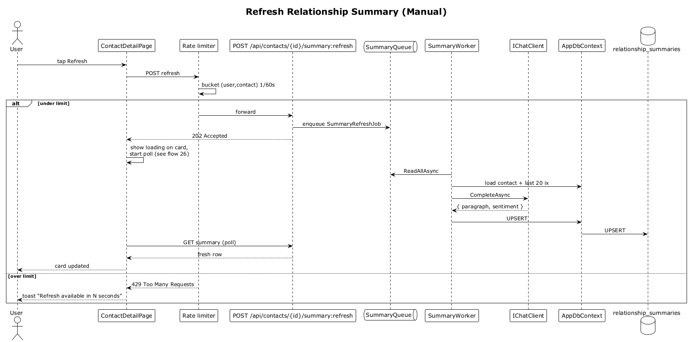

# 27 — Refresh Relationship Summary (Manual)

## Summary

The user taps the `Refresh` button on the summary card to manually regenerate the paragraph. The endpoint enqueues a refresh job and returns `202 Accepted`. A per-contact rate limit of 1/60 s prevents spam — the second tap inside 60 s returns `429`.

**Traces to:** L1-008, L2-031, L2-032.

## Actors

- **User** — authenticated owner.
- **ContactDetailPage** — `Refresh` button.
- **SummaryEndpoints** — `POST /api/contacts/{id}/summary:refresh`.
- **Rate limiter** — per-user, per-contact, 1/60 s.
- **SummaryQueue** + **SummaryWorker** — background LLM regeneration.

## Trigger

User taps `Refresh` on the summary card.

## Flow

1. User taps `Refresh`.
2. The SPA POSTs `/api/contacts/:id/summary:refresh`.
3. Rate limiter checks `(userId, contactId)` bucket — allow at most 1 in 60 s.
   - **Over limit** → `429 Too Many Requests`, SPA shows a toast "Refresh available in N seconds".
4. The endpoint enqueues `SummaryRefreshJob { contactId }` and responds `202 Accepted`.
5. The SPA shows a subtle loading affordance on the card and begins polling `/summary` every 1.5 s (max 15 s) per flow 26.
6. The worker regenerates the paragraph and UPSERTs the row.
7. The poll picks up the fresh row and the card updates in place.

## Alternatives and errors

- **Worker failure** → stale summary stays visible with a `stale` marker and automatic retry on the next open.
- **User navigates away** → polling stops; the regeneration still completes in the background.

## Sequence diagram

