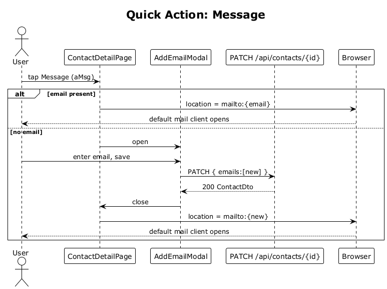

# 28 — Quick Action: Message

## Summary

The `Message` tile on the contact detail opens the user's default mail client with `mailto:` pre-filled with the primary email. When no email is on file, a modal opens to capture one before launching.

**Traces to:** L1-010, L2-037.

## Actors

- **User** — authenticated owner.
- **ContactDetailPage** — `Message` tile (`aMsg`).
- **Browser** — `mailto:` handler.
- **ContactsEndpoints** — `PATCH /api/contacts/{id}` for adding an email.

## Trigger

User taps the `Message` action tile.

## Flow

1. User taps `Message`.
2. The SPA inspects `contact.emails[0]`.
3. **Email present** → `window.location.href = 'mailto:' + email`. The mail client takes over.
4. **No email** → the SPA opens `AddEmailModal`:
   - User types email, taps Save.
   - SPA PATCHes `/api/contacts/:id` with `{ emails: [newEmail] }`.
   - On success, `mailto:` is launched with the new address.
5. Optionally, after launching, the SPA proposes a local interaction of type `email` with `subject="(outbound draft)"` that the user can confirm or cancel.

## Alternatives and errors

- **Invalid email** entered → `400` from the PATCH; the modal surfaces the error.
- **User closes the modal** → no navigation or send.
- **Browser blocks `mailto:`** (rare corporate policy) → SPA shows the email as selectable text so the user can copy manually.

## Sequence diagram

