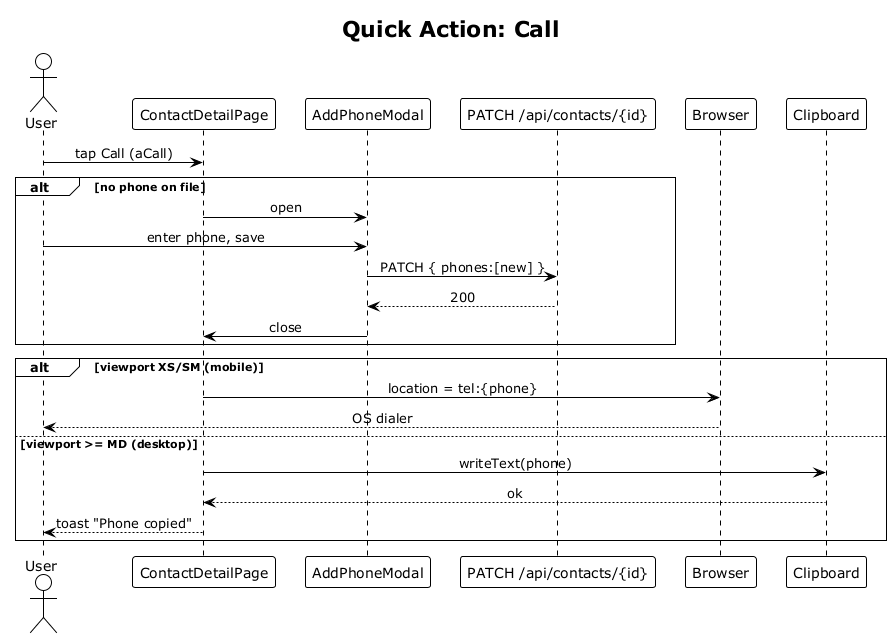

# 29 — Quick Action: Call

## Summary

The `Call` tile launches a `tel:` URL on mobile (XS/SM) or copies the phone number to the clipboard on desktop (≥ MD). When no phone is on file a modal captures one first.

**Traces to:** L1-010, L2-038.

## Actors

- **User** — authenticated owner.
- **ContactDetailPage** — `Call` tile (`aCall`).
- **Browser** — `tel:` handler.
- **Clipboard** — `navigator.clipboard.writeText`.
- **AddPhoneModal** — inline phone-capture form.
- **ContactsEndpoints** — `PATCH /api/contacts/{id}`.

## Trigger

User taps the `Call` action tile.

## Flow

1. User taps `Call`.
2. The SPA inspects `contact.phones[0]`.
3. **No phone** → `AddPhoneModal` opens → user adds phone → PATCH persists → continue with the newly added number.
4. **Phone present & viewport is XS/SM** → `window.location.href = 'tel:' + phone` (handed to the OS dialer).
5. **Phone present & viewport ≥ MD** → `navigator.clipboard.writeText(phone)` copies the number and a toast confirms "Phone copied".

## Alternatives and errors

- **Clipboard permission denied** (rare) → fall back to a modal showing the phone as selectable text.
- **Invalid phone** entered in the modal → `400`, surfaced inline.

## Sequence diagram

