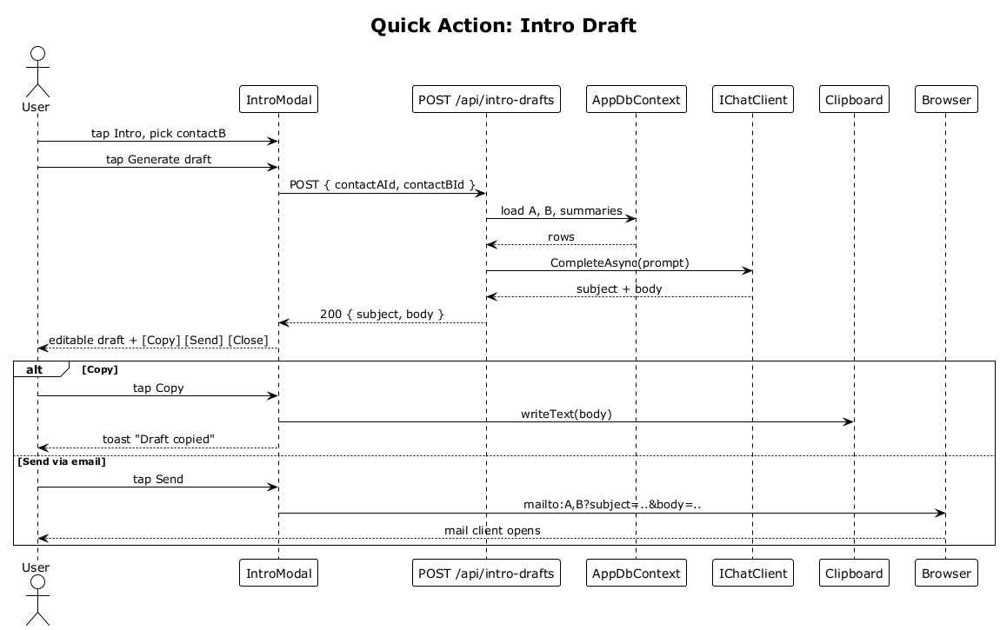

# 30 — Quick Action: Intro Draft

## Summary

The `Intro` tile opens a modal where the user picks the other party from their contacts. The server generates an AI intro draft (subject + body) referencing both parties' roles and relationships. The user can Copy the body to clipboard or Send via email (launching `mailto:` with both addresses).

**Traces to:** L1-010, L2-039.

## Actors

- **User** — authenticated owner.
- **IntroModal** — overlay.
- **IntroDraftEndpoints** — `POST /api/intro-drafts`.
- **AppDbContext** — loads both contacts and their summaries.
- **IChatClient** — LLM provider.
- **Clipboard**, **Browser** — delivery mechanisms.

## Trigger

User taps the `Intro` action tile from the contact detail view.

## Flow

1. User taps `Intro`.
2. `IntroModal` opens with the current contact (party A) pre-selected and a searchable picker for party B.
3. User picks party B and taps `Generate draft`.
4. The SPA POSTs `/api/intro-drafts { contactAId, contactBId }`.
5. The endpoint loads both contacts + their relationship summaries via `AppDbContext`.
6. The endpoint calls `IChatClient.CompleteAsync(prompt)`; the prompt includes both parties' roles, orgs, and a distillation from their summaries.
7. The LLM returns `{ subject, body }`.
8. Endpoint responds `200` with the draft.
9. The modal shows the editable draft with three buttons: `Copy`, `Send via email`, `Close`.

## Flow — Copy

1. User taps `Copy`.
2. SPA calls `navigator.clipboard.writeText(body)`.
3. Toast confirms `Draft copied`.

## Flow — Send via email

1. User taps `Send via email`.
2. SPA constructs `mailto:{A.email},{B.email}?subject={subject}&body={body}` and navigates to it.
3. Default mail client opens with both recipients and the draft content.

## Alternatives and errors

- **Either party has no email** → `Send via email` is disabled; user may still `Copy`.
- **LLM provider error** → `500`, modal shows error and a retry button.
- **Over rate limit** (Ask + intro share a bucket at the discretion of ops) → `429`.

## Sequence diagram

