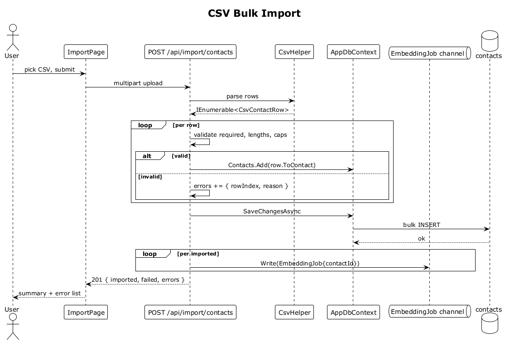

# 31 — CSV Bulk Import

## Summary

The user uploads a CSV to seed many contacts at once. The server parses the file with CsvHelper, validates each row, bulk-inserts the valid ones, enqueues an embedding job per imported contact, and returns a summary of `{ imported, failed, errors }`. Multi-value fields (`emails`, `phones`, `tags`) use semicolon separators.

**Traces to:** L1-018, L2-077, L2-078.

## Actors

- **User** — authenticated.
- **ImportPage** — file upload UI.
- **ImportEndpoints** — `POST /api/import/contacts` (multipart).
- **CsvHelper** — parser.
- **AppDbContext / contacts**.
- **EmbeddingJob channel**.

## Trigger

User picks a CSV and taps **Upload**.

## Flow

1. User selects a CSV with header `displayName, role, organization, emails, phones, tags, location`.
2. The SPA POSTs the file as multipart/form-data.
3. The endpoint streams the body through `CsvHelper.GetRecords<CsvContactRow>()`.
4. Per row:
   - Validate required `displayName`, length caps, multi-value caps (10 emails, 10 phones, 20 tags).
   - **Valid** → `ctx.Contacts.Add(row.ToContact(ownerId))`.
   - **Invalid** → append `{ rowIndex, reason }` to the error list.
5. `SaveChangesAsync` performs the bulk INSERT.
6. For each imported contact, `EmbeddingJob { contactId }` is written to the channel.
7. The endpoint returns `201 Created` with `{ imported, failed, errors: [...] }`.
8. The SPA renders a summary panel with the counts and a collapsed error list.

## Alternatives and errors

- **Malformed file** (not CSV, wrong encoding) → `400 Bad Request` with a descriptive error.
- **File > configured size cap** → `413 Payload Too Large`.
- **Entire file invalid** → `201` with `{ imported: 0, failed: N }` (endpoint is optimistic about partial success).
- **Embedding backlog** — the worker drains the queue asynchronously; the SPA does not block on embeddings.

## Sequence diagram

