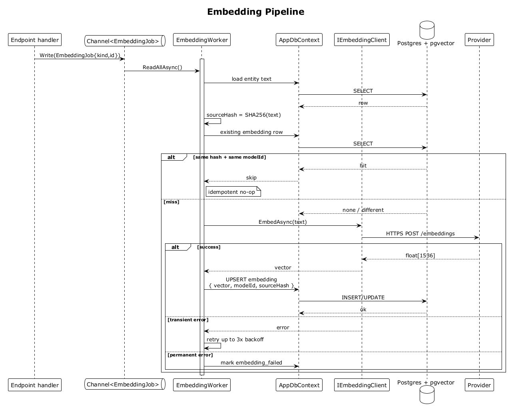

# 32 — Embedding Pipeline

## Summary

Any write that changes embedded text (create/update contact, create/update interaction, CSV import) enqueues an `EmbeddingJob` to an in-process `Channel<EmbeddingJob>`. The `EmbeddingWorker` (a hosted `BackgroundService`) drains the channel, computes a `sourceHash` over the text, skips regeneration when the hash + model match, otherwise calls `IEmbeddingClient.EmbedAsync`, and UPSERTs the vector into `pgvector`. The pipeline is idempotent and retry-safe.

**Traces to:** L1-018, L1-014, L2-078, L2-080.

## Actors

- **Endpoint handler** — producer (`ContactsEndpoints`, `InteractionsEndpoints`, `ImportEndpoints`).
- **Channel<EmbeddingJob>** — bounded in-process queue.
- **EmbeddingWorker** (BackgroundService) — consumer.
- **AppDbContext** — loads text, UPSERTs vectors.
- **IEmbeddingClient** — LLM embedding API.
- **Postgres + pgvector** — persistence + ANN index.

## Trigger

Any state-changing endpoint writes an `EmbeddingJob { kind, id }` to the channel.

## Flow

1. The endpoint writes an `EmbeddingJob` to the channel.
2. The `EmbeddingWorker` loop reads the job via `ReadAllAsync`.
3. Worker loads the entity (contact or interaction) from `AppDbContext`.
4. Worker computes `sourceHash = SHA256(concatenated text fields)`.
5. Worker queries the existing embedding row for this entity.
   - **Match (same hash + same `modelId`)** → skip. No provider call, no write.
   - **Miss** → proceed.
6. Worker calls `IEmbeddingClient.EmbedAsync(text)`.
7. Worker UPSERTs `{ entityId, vector, modelId, sourceHash, createdAt }` into `contact_embeddings` or `interaction_embeddings`.
8. `SaveChangesAsync` commits.

## Alternatives and errors

- **Transient provider error** → retry up to 3 times with exponential backoff.
- **Permanent failure** → mark `embedding_failed = true`; the record is surfaced on an admin/status endpoint.
- **Worker crash** → on restart, the channel is empty (in-memory), but a reconciler sweep can re-enqueue anything missing an embedding.
- **Duplicate enqueue** (e.g., two updates in rapid succession) → second job sees identical `sourceHash`, short-circuits.

## Sequence diagram

