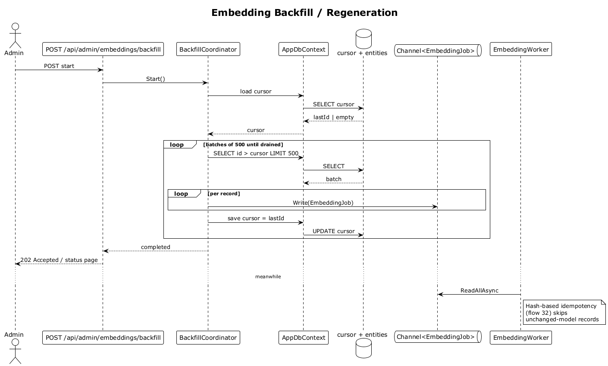

# 33 — Embedding Backfill / Regeneration

## Summary

An internal admin endpoint / CLI command walks every contact and interaction and enqueues an embedding refresh. The operation is **resumable** (uses a cursor so restarts skip already-processed records) and **safe** (hash-based idempotency means re-embedding with the same model is a no-op). Triggered typically on an embedding-model upgrade.

**Traces to:** L1-018, L2-079, L2-080.

## Actors

- **Admin** — operator running the backfill (via CLI or internal endpoint).
- **BackfillEndpoints** — `POST /api/admin/embeddings/backfill`.
- **BackfillCoordinator** — stateful service that walks records and writes jobs.
- **Cursor store** — persistent record of last processed id.
- **Channel<EmbeddingJob>** + **EmbeddingWorker** — same pipeline as flow 32.
- **AppDbContext** — reads entities, persists cursor.

## Trigger

Admin POSTs `/api/admin/embeddings/backfill`, or runs the CLI.

## Flow

1. Admin triggers backfill.
2. The coordinator loads the cursor (defaults to `Guid.Empty`).
3. In a streaming loop, the coordinator queries `contacts` and `interactions` where `id > cursor` ordered by `id`, in batches of 500.
4. For each batch:
   - Enqueue an `EmbeddingJob` per record.
   - Advance the cursor and persist it.
5. The `EmbeddingWorker` drains the channel (flow 32). Records with unchanged text on the current model are short-circuited by the hash check.
6. When the cursor reaches the end, the coordinator marks the backfill complete.

## Alternatives and errors

- **Process killed mid-run** → on restart, cursor is loaded; the loop resumes where it left off without duplicating work.
- **Model-mismatch on search during backfill** (L2-080 §2) → `/api/search` returns `503 Service Unavailable` until the backfill of current-model coverage reaches a threshold, and a message indicates embeddings are regenerating.
- **Partial failures** → logged; `embedding_failed` rows are reported on the status endpoint.

## Sequence diagram

