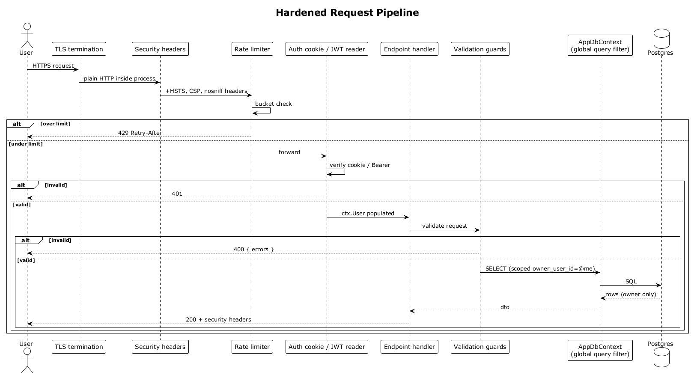

# 34 — Hardened Request Pipeline

## Summary

Every HTTPS request traverses a layered middleware chain before it reaches a handler: TLS termination, security-headers middleware (HSTS / CSP / nosniff / etc.), rate limiter, auth cookie/JWT reader, endpoint handler, validation guards, and finally `DbContext` with a global query filter scoped to the owning user. Any layer can short-circuit the request without leaking data.

**Traces to:** L1-013, L2-052–L2-057, L2-072.

## Actors

- **User** — browser client.
- **TLS** — Kestrel or upstream reverse proxy.
- **Security-headers middleware** — response-side headers.
- **Rate limiter** — per-IP and per-user buckets.
- **Auth reader** — populates `HttpContext.User`.
- **Endpoint handler** — feature code.
- **Validation guards** — inline guard clauses / data annotations.
- **AppDbContext** — global query filter on `OwnerUserId`.
- **Postgres**.

## Trigger

Any inbound HTTPS request.

## Flow

1. Client sends HTTPS.
2. TLS is terminated; HTTP inside the process.
3. Security-headers middleware adds `Strict-Transport-Security`, `Content-Security-Policy`, `X-Content-Type-Options: nosniff`, `Referrer-Policy: strict-origin-when-cross-origin`, `X-Frame-Options: DENY` to the response pipeline.
4. Rate limiter checks the applicable bucket (IP, user, endpoint). Over → `429` with `Retry-After` and the request exits.
5. Auth reader inspects the `Authorization: Bearer` header or the session cookie. Valid → `HttpContext.User` is populated; `ICurrentUser` is scoped with `Id`. Invalid → `401`.
6. Endpoint handler runs. Validation guards reject malformed payloads with `400`.
7. `DbContext` executes SQL, and the global query filter rewrites every query to include `owner_user_id = @currentUser.Id` — so missed filters at the endpoint layer cannot leak foreign rows.
8. Rows return, DTO is serialised, security headers are written, the response leaves TLS.

## Alternatives and errors

- **Cookie auth without CSRF token** on a state-changing method → `403 Forbidden` (flow double-submit or SameSite=Strict).
- **Bearer token in query string** → `400 Bad Request`; security event logged.
- **Validation failure** → `400` with field errors, no database access.

## Sequence diagram

