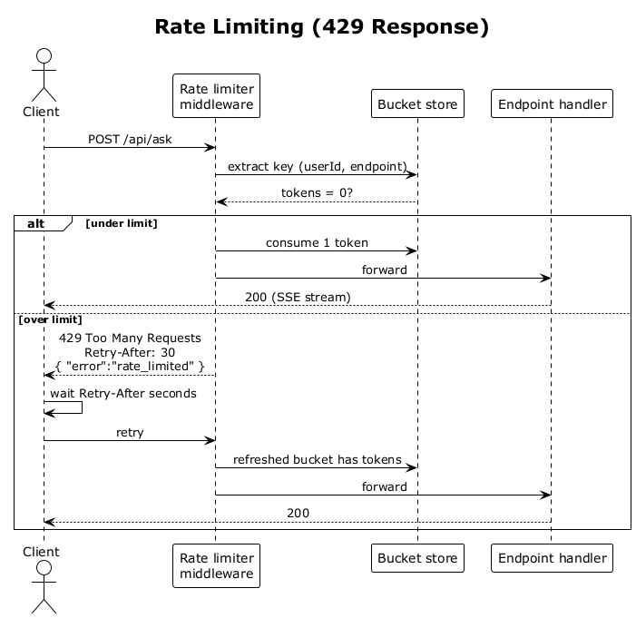

# 35 — Rate Limiting (429 Response)

## Summary

Login, registration, search, Ask, and summary-refresh each have per-user and per-IP buckets. When a caller exceeds the configured budget the middleware short-circuits the pipeline with `429 Too Many Requests` and a `Retry-After` header; the endpoint handler never runs.

**Traces to:** L1-013, L2-055, L2-032.

## Actors

- **Client** — browser.
- **Rate limiter middleware** — ASP.NET Core `AddRateLimiter` with token buckets.
- **Bucket store** — in-memory (or distributed in HA deployments).
- **Endpoint handler** — never reached when over limit.

## Buckets (defaults)

| Endpoint / action | Limit |
|---|---|
| `POST /api/auth/login` | 5 / 60 s per (email, IP) |
| `POST /api/auth/register` | 5 / 60 s per IP |
| `POST /api/search` | 60 / 60 s per user |
| `POST /api/ask` | 20 / 60 s per user |
| `POST /api/contacts/{id}/summary:refresh` | 1 / 60 s per (user, contact) |

## Trigger

A client call arrives at an endpoint that is gated.

## Flow

1. Client sends the request.
2. The rate limiter extracts the bucket key (IP, user id, email, contact id depending on policy).
3. The limiter checks token availability.
4. **Under limit** → consume one token, forward to the endpoint. Normal processing applies.
5. **Over limit** → short-circuit with `429 Too Many Requests`, `Retry-After: <seconds>` header, and a small body `{ "error": "rate_limited", "retryAfter": N }`. No endpoint code runs.
6. The client may retry after `Retry-After` seconds.

## Alternatives and errors

- **Distributed deployment** — the in-memory store is swapped for Redis or a shared store so limits are global, not per-instance.
- **Admin bypass** — admin identities may have a higher bucket size (configurable); never disabled entirely.

## Sequence diagram

