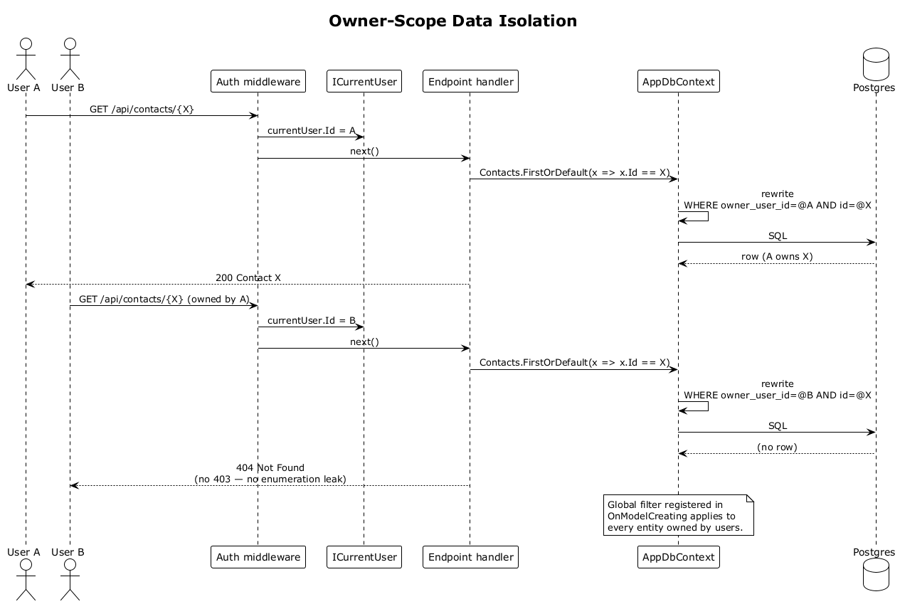

# 36 — Owner-Scope Data Isolation

## Summary

Every EF Core entity owned by a user (`Contact`, `Interaction`, `ContactEmbedding`, `InteractionEmbedding`, `RelationshipSummary`, `Stack`, `Suggestion`) is registered with a global query filter `e => e.OwnerUserId == _currentUser.Id`. The filter is attached once at `DbContext` configuration and every subsequent `ctx.Contacts.Where(...)`, `Find`, `FirstOrDefault`, or raw SQL path is automatically scoped. A missed filter at the endpoint layer cannot leak data.

**Traces to:** L1-013, L2-006, L2-056.

## Actors

- **AppDbContext** — configures filters in `OnModelCreating`.
- **ICurrentUser** — scoped service, resolved per request from the authenticated principal.
- **Endpoint handler** — queries `DbContext` directly (no repository).
- **Background workers** (`EmbeddingWorker`, `SummaryWorker`, `SuggestionDetector`) — use a separate per-user scope when acting on a user's data.

## Trigger

Any database access in a request or background job scope.

## Flow — request-scope

1. Auth middleware sets `HttpContext.User`; `ICurrentUser` is scoped and exposes `.Id`.
2. `DbContext` is resolved from DI; its query filters close over `_currentUser` via the captured `Func<Guid>`.
3. The endpoint writes `ctx.Contacts.FirstOrDefault(x => x.Id == id)`.
4. EF Core rewrites the SQL to include `WHERE owner_user_id = @currentUser AND id = @id`.
5. Foreign-owner rows never match. `null` is returned. The endpoint maps to `404 Not Found`.

## Flow — background worker

1. The worker's job carries a `userId`.
2. A per-job DI scope is created with an `ICurrentUser` impl bound to `userId`.
3. All queries in that scope are filtered to that user's data; no cross-user bleed.

## Flow — raw SQL

1. Any hand-crafted SQL (the vector-search CTE is the main case) is **required** to include `owner_user_id = @userId` explicitly — reviewed as part of PR scrutiny.
2. A test case asserts that a user's query against pgvector never returns rows owned by a different user.

## Alternatives and errors

- **Filter escape hatch** (`IgnoreQueryFilters`) is never used in handler code. It is reserved for explicit admin utilities.
- **Non-user entities** (e.g., `User` itself, system config) have no filter and are accessed without scope.

## Sequence diagram

