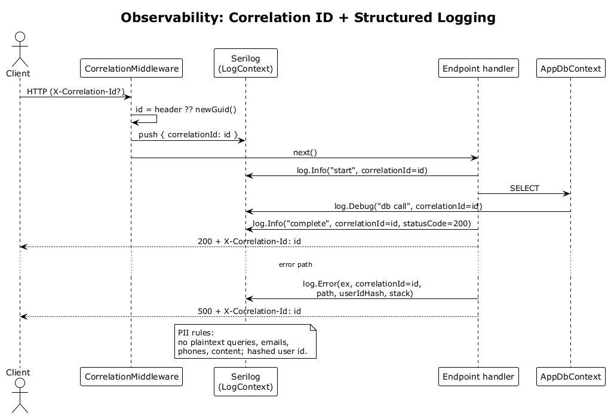

# 37 — Observability: Correlation ID + Structured Logging

## Summary

A `CorrelationMiddleware` assigns (or honours) a GUID correlation id per request. Serilog is configured with an enricher that attaches the id to every log entry emitted during the request. The id is echoed back in the `X-Correlation-Id` response header so clients (and engineers) can pivot from a user-reported failure to server logs in one query.

**Traces to:** L1-016, L2-069, L2-071.

## Actors

- **Client** — browser.
- **CorrelationMiddleware** — first middleware after TLS/security headers.
- **Serilog** — structured logger with enrichers.
- **Endpoint handler** — feature code.
- **AppDbContext** — queries inside the request.

## Trigger

Any inbound request.

## Flow

1. Client sends a request. May include `X-Correlation-Id`.
2. `CorrelationMiddleware` reads the header. If absent or invalid it generates a new GUID.
3. The id is stored in `HttpContext.Items["CorrelationId"]` and pushed into Serilog's `LogContext` via an enricher.
4. The endpoint and all downstream code (`ctx.Contacts.Where`, `IChatClient`, workers kicked off for this request) log structured JSON that includes `correlationId`.
5. On completion, the middleware writes `X-Correlation-Id` on the response.
6. On exception, the exception handler logs a structured error with correlation id, endpoint path, hashed user id, and stack trace.

## PII rules

- `content`, `displayName`, query strings, emails, phone numbers **must not** appear in logs.
- Where a user id is needed, a hashed id is logged (e.g., SHA-256 prefix).
- Queries may be replaced by `queryHash` or `queryLength`.

## Sequence diagram

