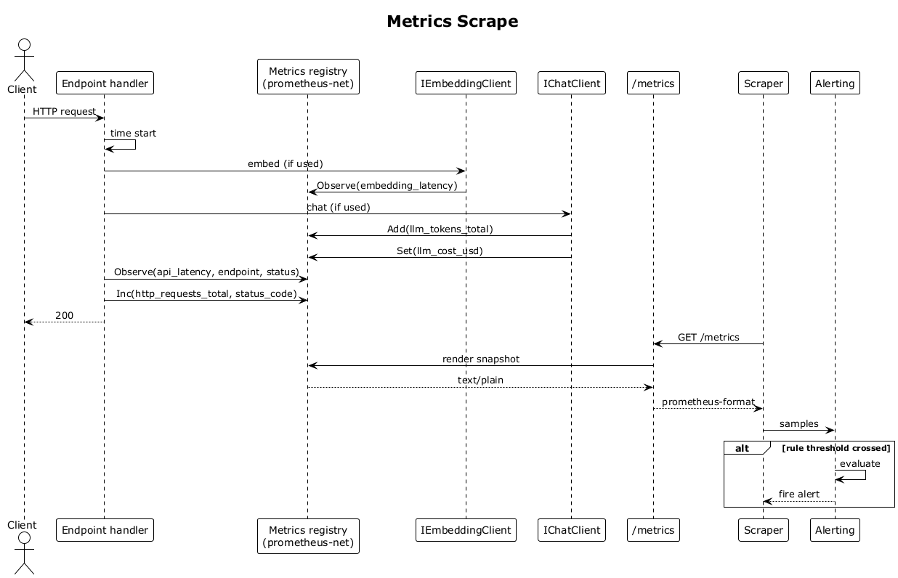

# 38 — Metrics Scrape (/metrics)

## Summary

The API exposes Prometheus-format metrics on `/metrics`. Histograms cover API latency per endpoint, embedding-generation latency, vector-search latency; counters cover LLM tokens consumed, per-endpoint `4xx/5xx`; gauges cover LLM cost per request. A scraper pulls this endpoint on an interval; alerting rules evaluate sustained error rates.

**Traces to:** L1-016, L2-070.

## Actors

- **Endpoint handler** / **EmbeddingWorker** / **SummaryWorker** — emit measurements.
- **Metrics registry** (`prometheus-net`) — accumulates samples.
- **/metrics endpoint** — Prometheus text exposition format.
- **Scraper** — Prometheus or a compatible poller.
- **Alerting** — evaluates rules against scraped data.

## Metrics emitted

| Name | Type | Labels |
|---|---|---|
| `recallq_api_latency_seconds` | histogram | endpoint, status |
| `recallq_embedding_latency_seconds` | histogram | model |
| `recallq_vector_search_latency_seconds` | histogram | |
| `recallq_llm_tokens_total` | counter | endpoint, direction (in/out) |
| `recallq_llm_cost_usd` | gauge | endpoint |
| `recallq_http_requests_total` | counter | endpoint, status_code |

## Trigger

- Every request and every worker job emits measurements.
- The scraper polls `/metrics` on a schedule (e.g., every 15 s).

## Flow

1. Endpoint handler measures its duration and calls `recallq_api_latency_seconds.WithLabels(endpoint, status).Observe(duration)`.
2. For each `4xx/5xx` response, `recallq_http_requests_total` is incremented with the status code label.
3. `IEmbeddingClient` wraps its provider call in `Measure` which feeds `recallq_embedding_latency_seconds`.
4. `IChatClient` tallies tokens in/out via `recallq_llm_tokens_total` and cost via `recallq_llm_cost_usd`.
5. The scraper GETs `/metrics`. The registry renders the current snapshot in Prometheus text format.
6. The scraper ingests the samples; alerting rules (`sum(rate(recallq_http_requests_total{status_code=~"5.."}[5m])) / sum(rate(...))`) fire alerts when thresholds are crossed.

## Alternatives and errors

- **Scraper unavailable** → samples accumulate in-memory with a fixed cap; old ones are dropped.
- **PII labels** — never label a metric with raw query text, contact names, or content. Only endpoint names, status codes, and model identifiers.

## Sequence diagram

