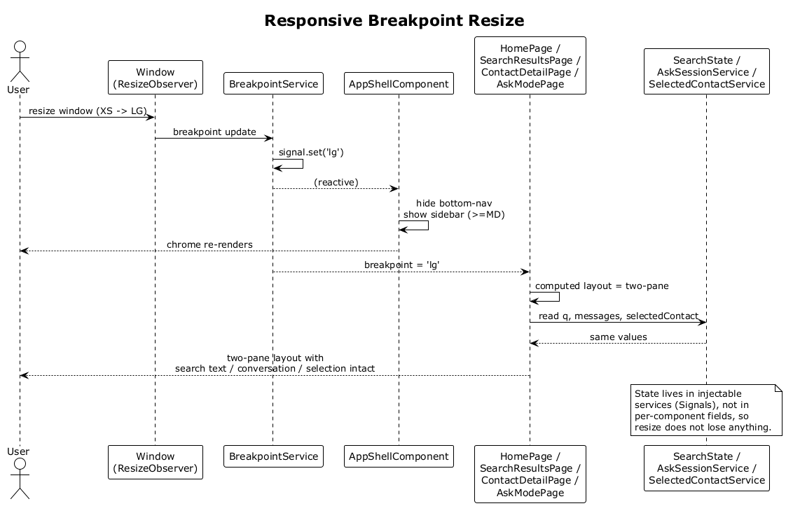

# 39 — Responsive Breakpoint Resize (State Preservation)

## Summary

The Angular SPA listens to viewport changes via a `BreakpointService` signal. As the window crosses XS → SM → MD → LG → XL boundaries the layout swaps between single-column mobile, centered narrow, top-nav, two-pane, and three-pane variants — without remounting feature components. The search bar text, Ask conversation, and selected contact are preserved because state lives in injectable services, not in per-component state.

**Traces to:** L1-011, L2-041 through L2-046.

## Actors

- **User** — resizes the browser or rotates a device.
- **BreakpointService** — `signal<Breakpoint>` updated from a ResizeObserver / `matchMedia`.
- **AppShellComponent** — swaps nav (bottom-nav / top-nav / sidebar).
- **HomePage / SearchResultsPage / ContactDetailPage / AskModePage** — bind layout to the breakpoint signal.
- **SearchState / AskSessionService / SelectedContactService** — long-lived state stores.

## Trigger

User resizes the window or changes orientation so the viewport crosses a breakpoint.

## Flow

1. `BreakpointService` observes resize.
2. When a breakpoint boundary is crossed, the `breakpoint` signal updates (e.g., `'xs'` → `'lg'`).
3. `AppShellComponent` recomputes `*ngIf` for the bottom nav / top nav / sidebar and re-renders chrome accordingly (mobile bottom nav hidden, sidebar shown, etc.).
4. Feature pages read their layout template from a `@computed` that depends on the breakpoint signal (e.g., two-pane vs single-column). The component instance itself is not destroyed, so:
   - The search input's `q` signal is unchanged.
   - The Ask conversation messages signal is unchanged.
   - The selected contact signal is unchanged.
5. Because nothing is re-fetched on layout swap, the user sees the same data in a new arrangement instantly.

## Alternatives and errors

- **Full reload** — resets state (v1 does not persist to storage).
- **Keyboard open on mobile** — `inputBar` sits above the keyboard via `env(safe-area-inset-bottom)` and a `visualViewport` listener.
- **Orientation change** without crossing a breakpoint → the breakpoint signal does not emit; components do not re-layout.

## Sequence diagram

