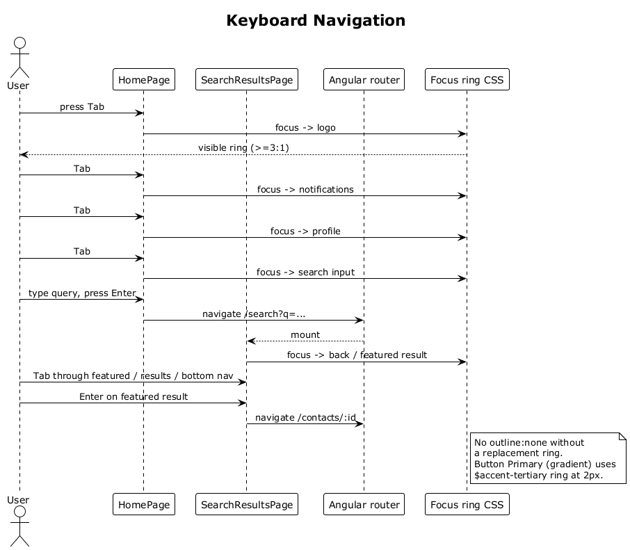

# 40 — Keyboard Navigation

## Summary

Every interactive element is reachable and operable using the keyboard alone. Tab order follows visual reading order on each screen. `Enter` and `Space` activate the focused element. A visible focus ring meets a 3:1 contrast minimum, and the gradient `Button Primary` uses a solid `$accent-tertiary` ring so it remains visible against the gradient.

**Traces to:** L1-015, L2-064, L2-065, L2-066.

## Actors

- **User** — keyboard user (sighted or screen-reader user).
- **AppShell / HomePage** — top bar, search, chips, stacks, bottom nav.
- **Feature pages** — each owns its tab order.
- **Focus visible** — native browser focus + CSS override.

## Trigger

User presses `Tab`, `Shift+Tab`, `Enter`, or `Space`.

## Flow — home screen

1. On home load, focus defaults to the SPA main landmark.
2. `Tab` cycles in visual order: logo → notifications bell → profile avatar → search input → suggestion chips → AI suggestion primary → AI suggestion dismiss → stack cards → bottom nav items.
3. On each stop, the focus ring renders at ≥ 2 px with ≥ 3:1 contrast.
4. `Enter` or `Space` on the focused element executes its primary action (e.g., open search, open AI suggestion target).
5. `Enter` in the search input submits the search (same as tapping).

## Flow — Ask mode

1. `Tab` enters the input area; `Shift+Tab` retreats.
2. `Enter` in the input submits the question.
3. Focus moves into the answer bubble on completion, announced via `aria-live` (flow 41).
4. Follow-up chips become focusable after they render; `Enter` activates a chip.

## Flow — modal (AddEmailModal, IntroModal)

1. Opening the modal traps focus inside.
2. `Tab` cycles only within modal elements.
3. `Esc` closes the modal and returns focus to the trigger.

## Alternatives and errors

- **`outline: none`** is never used without a replacement ring.
- **Click-only handlers** are wrapped so `keydown` on `Enter/Space` mirrors the click (for `
` cases; the default is to use real `<button>` elements).
- **Skip link** at the top of the page jumps past chrome to the main content.

## Sequence diagram

