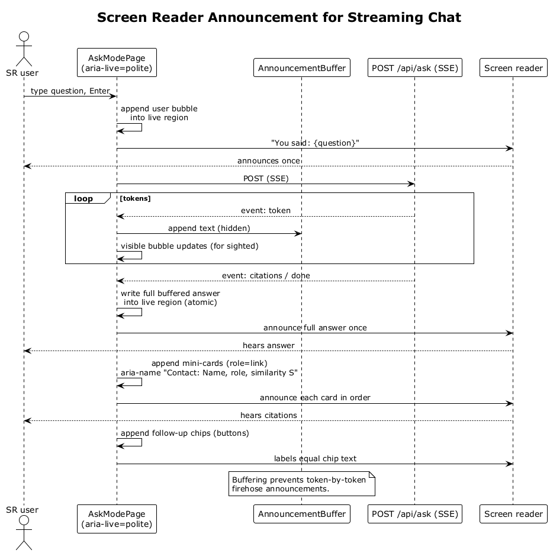

# 41 — Screen Reader Announcement for Streaming Chat

## Summary

The Ask chat uses an `aria-live="polite"` region so screen readers hear user messages and assistant answers in order. Streaming is buffered at the announcement layer so assistive technology does not receive token-by-token updates; the final answer is announced once after `done`. Citation mini-cards have `role="link"` with an accessible name `Contact: {name}, {role}, similarity {score}`.

**Traces to:** L1-015, L2-068.

## Actors

- **User** — screen-reader user.
- **AskModePage** — live-region container.
- **AnnouncementBuffer** — debounces/holds streaming tokens until `done`.
- **Screen reader** — NVDA / JAWS / VoiceOver / TalkBack.

## Trigger

User sends a question in Ask mode with a screen reader active.

## Flow

1. User types the question; the input's `aria-label` is `Ask a question`.
2. On Send, the user bubble is appended to an `aria-live="polite"` region with text `You said: {question}`. The screen reader announces it once.
3. The assistant answer bubble is also inside the live region, but **streaming tokens are written to a hidden buffer**, not to the announcement node. The visible UI still renders tokens progressively (sighted users see them live).
4. When the server emits `event: done`, the buffered full answer text is atomically written into the live region. The screen reader announces the entire answer once.
5. Citation mini-cards are appended afterwards; each exposes `role="link"` and an accessible name like `Contact: Sarah Mitchell, VP Product at Stripe, similarity 0.91`. They are announced in order.
6. Follow-up chips are focusable buttons with accessible names equal to the chip text.

## Alternatives and errors

- **Stream fails mid-response** → the partial buffered text is announced with a final phrase `(stream interrupted)` so the user is not left confused.
- **User navigates away during streaming** → the live region is torn down and the announcement is cancelled.
- **Rapid follow-up answers** → each new assistant bubble gets its own live update, never interleaving with a previous unfinished one.

## Sequence diagram

